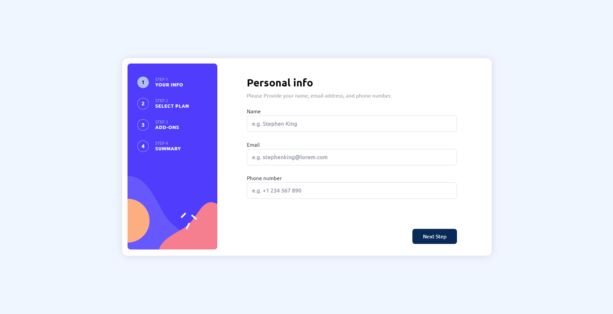

# Frontend Mentor - Multi-step form solution

This is a solution to the [Multi-step form challenge on Frontend Mentor](https://www.frontendmentor.io/challenges/multistep-form-YVAnSdqQBJ). Frontend Mentor challenges help you improve your coding skills by building realistic projects.

## Table of contents

- [Overview](#overview)
  - [The challenge](#the-challenge)
  - [Screenshot](#screenshot)
  - [Links](#links)
- [My process](#my-process)
  - [Built with](#built-with)
  - [What I learned](#what-i-learned)
- [Author](#author)

## Overview

### The challenge

Users should be able to:

- Complete each step of the sequence
- Go back to a previous step to update their selections
- See a summary of their selections on the final step and confirm their order
- View the optimal layout for the interface depending on their device's screen size
- See hover and focus states for all interactive elements on the page
- Receive form validation messages if:
  - A field has been missed
  - The email address is not formatted correctly
  - A step is submitted, but no selection has been made

### Screenshot



### Links

- Solution URL: [Add solution URL here](https://github.com/kenkkui/multi-step-form)
- Live Site URL: [Add live site URL here](https://kenkkui.github.io/multi-step-form/)

## My process

### Built with

- Semantic HTML5 markup
- CSS custom properties
- Flexbox
- CSS Grid
- Desktop-first workflow
- [React](https://reactjs.org/) - JS library

### What I learned

During this time of coding, i learned how to use reusable React components as well as mapping a lot through code. I learned a lot on how to minimize the usage of States in the component, which caused some issues at first but i was able to overcome them as time went on. If you have propaply seen, i have tons of commits on this project alone, i don't think that is normal so i will try to minimize the amount of commits from now on.

this was for the mapping mostly...

```js
{
  INPUTS.map((input) => {
    return (
      <Inputs
        key={input.id}
        type={input.type}
        subject={input.subject}
        placeholder={input.placeholder}
        isError={isError}
        info={info}
        setInfo={setInfo}
      />
    );
  });
}
```

## Author

- Frontend Mentor - [@kenkkui](https://www.frontendmentor.io/profile/kenkkui)
